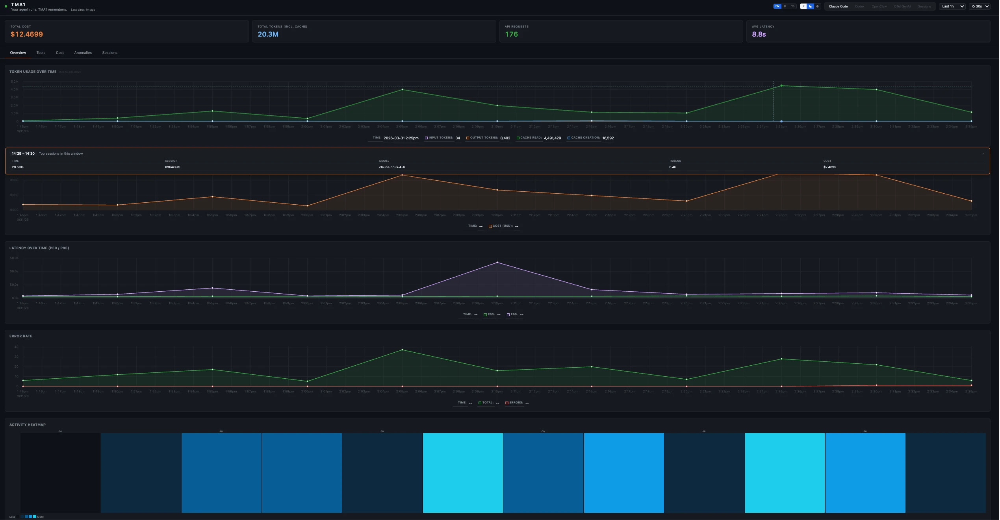

# TMA1

> A monolith for your agent's loop. Silent until it talks back.

TMA1 is local-first observability for LLM agents, powered by GreptimeDB.
It records every LLM call on your machine, then routes what it sees back
into the agent's next turn through hooks and MCP tools.

One binary. No Docker. No Grafana. No cloud account.



The name comes from TMA-1 (Tycho Magnetic Anomaly-1) in *2001: A Space
Odyssey*: the monolith buried on the moon, silently recording everything
until you dig it out.

## What TMA1 Does

TMA1 has two jobs:

1. Show the human what happened.
2. Tell the agent what it should notice before the next step.

The dashboard gives you token usage, cost, latency, tool activity, full
conversation replay, anomaly history, prompt evaluation, and SQL access to
the underlying data.

The agent loop gives Claude Code and Codex a compact `<tma1-context>` block
before each turn, can block `Stop` when a HIGH-severity issue is still
unresolved, and exposes seven MCP tools the agent can call on demand.

## Supported Sources

| Source | How TMA1 reads it | What you get |
|--------|-------------------|--------------|
| Claude Code | OTel metrics/logs/traces, hooks, JSONL transcripts | Cost, tools, traces, sessions, anomalies, injected context |
| Codex | OTel logs/metrics, hooks, JSONL sessions | Cost, tools, sessions, anomalies, injected context |
| Copilot CLI | JSONL sessions from `~/.copilot/session-state/` | Sessions, tools, cost where available |
| OpenClaw | OTel traces/metrics, JSONL sessions | Traces, cost, sessions, security signals |
| Any GenAI app | OTel traces using GenAI semantic conventions | Traces, latency, cost aggregation |

All data is stored locally under `~/.tma1/`.

## Install

macOS / Linux:

```bash
curl -fsSL https://tma1.ai/install.sh | bash
```

Windows PowerShell:

```powershell
irm https://tma1.ai/install.ps1 | iex
```

Start the server:

```bash
tma1-server
```

Open the dashboard:

```bash
open http://localhost:14318
```

On first start, TMA1 writes a GreptimeDB config into `~/.tma1/config/`,
downloads the GreptimeDB binary if needed, starts it as a child process, and
serves the dashboard from the same `tma1-server` process.

## Wire An Agent

The easiest path is to let the agent read the setup skill:

```text
Read https://tma1.ai/SKILL.md and follow the instructions to install or upgrade TMA1 for your AI agent
```

To wire adapters during install:

```bash
# Claude Code
curl -fsSL https://tma1.ai/install.sh | TMA1_ADAPTER=claude-code bash

# Codex
curl -fsSL https://tma1.ai/install.sh | TMA1_ADAPTER=codex bash

# Both
curl -fsSL https://tma1.ai/install.sh | TMA1_ADAPTER=all bash
```

The curl installer writes global files only: hook scripts, MCP config, and
the `/tma1-peer` skill. It does not edit project-local `AGENTS.md` or
`CLAUDE.md`, because curl-pipe can run from any directory.

To seed project-local instructions, run from the project root:

```bash
tma1-server install --adapter claude-code --project .
tma1-server install --adapter codex --project .
```

Uninstall adapter wiring:

```bash
tma1-server uninstall --adapter claude-code --project .
tma1-server uninstall --adapter codex --project .
```

## Closing The Agent Loop

TMA1 pushes and pulls context.

**Hooks push context into the next agent turn.**

Claude Code gets five injection events: `SessionStart`, `UserPromptSubmit`,
`PostToolUse`, `Stop`, and `PreCompact`. Codex gets the four it supports;
Codex has no `PreCompact` hook.

The hook script POSTs to `http://127.0.0.1:14318/api/hooks`. The response
body becomes agent context. If TMA1 is down or slow, the hook returns empty
stdout and lets the agent continue.

**MCP lets the agent ask for context on demand.**

The MCP server is the same binary:

```bash
tma1-server mcp-serve
```

It exposes:

| Tool | Purpose |
|------|---------|
| `get_context_bundle` | One compact view of session state, anomalies, build status, external changes, and project structure |
| `get_session_state` | Tool history, token totals, current focus, recent files |
| `get_anomalies` | Active anomalies for the session |
| `get_build_status` | Last captured build/dev output |
| `get_external_changes` | Files changed outside the agent loop |
| `get_project_state` | Cached project language, build system, key files, top-level dirs |
| `get_peer_sessions` | Recent work left by peer agents on the same project |

`/tma1-peer codex` is a thin skill wrapper around `get_peer_sessions`: it
lets Claude Code read what Codex just did on the same project, verbatim. The
Codex-side skill works the other direction.

## How It Fits Together

```text
Agent -- OTLP/HTTP --+
       -- /api/hooks +--> tma1-server (port 14318)
       -- MCP stdio --+        |
                              v
                        GreptimeDB (port 14000)
                              |
                              v
                        Embedded dashboard
```

TMA1 reverse-proxies OTLP to GreptimeDB, ingests hook events and JSONL
transcripts, runs the perception layer, stores everything in GreptimeDB, and
serves the dashboard.

Traces, metrics, and logs are kept as queryable data. Session data and
anomaly emits live in `tma1_*` tables. You can query through the dashboard,
the HTTP SQL API, or MySQL protocol on port `14002`.

## Build Sensor

Use the build wrapper when you want TMA1 to capture dev/test output and feed
fresh failures back to the agent. Two modes:

```bash
# One-shot — wrapper exits with the wrapped command's exit code:
tma1 build --tag test -- make test
tma1 build --filter-regex '^error|FAIL' -- pytest -v

# Persistent (dev servers, watchers) — use --watch for time-debounced flush
# and Ctrl-C signal forwarding:
tma1 build --watch --tag dev -- npm run dev
tma1 build --watch --tag watch -- cargo watch -x test
```

The build sensor writes to `tma1_build_events`. Anomaly rules
(`repeated_failed_build`, `build_broken_after_my_edit`) read this table
to tell the agent to stop retrying the same failing command and fix the
current error first.

Supported flags:

| Flag | Purpose |
|------|---------|
| `--watch` | Long-running mode: flush on a debounce interval instead of by line count, and forward SIGINT/SIGTERM to the wrapped process. Required for persistent processes like `npm run dev`. |
| `--debounce DUR` | Flush interval for `--watch` (default `2s`) |
| `--tag NAME` | Tag this build run so the dashboard can group it (e.g. `npm`, `pytest`) |
| `--filter-regex PAT` | Only capture lines matching the pattern |
| `--filter-invert` | Invert the filter — capture lines NOT matching the pattern |
| `--no-color` | Strip ANSI color codes from captured output |
| `--project DIR` | Override the project directory used for scoping (default: cwd) |

## OTLP Endpoints

Use the wildcard endpoint when the agent or SDK supports it:

```text
http://localhost:14318/v1/otlp
```

Direct signal endpoints are also accepted:

```text
http://localhost:14318/v1/traces
http://localhost:14318/v1/metrics
http://localhost:14318/v1/logs
```

Codex commonly uses separate per-signal endpoints; most OTel SDKs can use
the single `/v1/otlp` base.

## Configuration

| Variable | Default | Description |
|----------|---------|-------------|
| `TMA1_HOST` | `127.0.0.1` | Address `tma1-server` binds to |
| `TMA1_PORT` | `14318` | HTTP port for `tma1-server` |
| `TMA1_DATA_DIR` | `~/.tma1` | Data, config, and binary directory |
| `TMA1_GREPTIMEDB_VERSION` | `latest` | GreptimeDB version to install |
| `TMA1_GREPTIMEDB_HTTP_PORT` | `14000` | GreptimeDB HTTP and OTLP port |
| `TMA1_GREPTIMEDB_GRPC_PORT` | `14001` | GreptimeDB gRPC port |
| `TMA1_GREPTIMEDB_MYSQL_PORT` | `14002` | GreptimeDB MySQL protocol port |
| `TMA1_LOG_LEVEL` | `info` | `debug`, `info`, `warn`, or `error` |
| `TMA1_DATA_TTL` | `60d` | Default TTL for auto-created tables |
| `TMA1_LLM_API_KEY` | empty | API key for optional prompt evaluation |
| `TMA1_LLM_PROVIDER` | `anthropic` | `anthropic` or `openai` |
| `TMA1_LLM_MODEL` | auto | Model override for prompt evaluation |
| `TMA1_QUERY_CONCURRENCY` | `4` | Max concurrent SQL queries from the dashboard |
| `TMA1_ADAPTER` | empty | Install-time adapter list: `claude-code`, `codex`, comma-separated, or `all` |
| `TMA1_MCP_CALLER` | empty | Set by adapter installers so peer-session queries exclude the caller |
| `TMA1_DISABLE_INJECTION` | unset | Set to `1` to record hooks but return no injected context |
| `TMA1_ENABLE_FILE_CALLBACK` | unset | Set to `1` to write `.tma1-context.md` for non-MCP agents |
| `TMA1_CONTEXT_PRESSURE_THRESHOLD` | `100000` | Input-token threshold for context-pressure anomalies |
| `OPENCLAW_STATE_DIR` | `~/.openclaw` | Override the OpenClaw session directory |

Settings changed in the dashboard are saved to `~/.tma1/settings.json`.
Environment variables take priority.

## CLI

The `tma1-server` binary (aliased to `tma1` by the installer) is one
entry point for everything.

| Command | Purpose |
|---------|---------|
| `tma1 install --adapter <name>` | Wire a coding agent into TMA1 (`claude-code`, `codex`) |
| `tma1 uninstall --adapter <name>` | Reverse install for one adapter |
| `tma1 build [--watch] -- <cmd>` | Wrap a build/test command and ship its output into `tma1_build_events` |
| `tma1 mcp-serve` | JSON-RPC MCP stdio server (spawned by agents, not run by hand) |
| `tma1 help [SUB]` | Print top-level usage, or details for a specific subcommand |
| `tma1 version` | Print the tma1-server version |

Every subcommand accepts `-h` / `--help`. Run `tma1 help build` or
`tma1 build --help` for the full flag list and examples.

## Development

```bash
make build           # Build server/bin/tma1-server
make run             # Build and run locally
make dev             # Auto-rebuild and restart on server file changes (requires fswatch)
make install         # Install dev build to ~/.tma1/bin
make sync-plugin     # Mirror plugin skills/commands into embedded server files
make vet             # go vet ./cmd/... ./internal/... ./web
make lint            # golangci-lint v2
make lint-js         # ESLint for dashboard JS
make test            # go test -race -count=1
make check           # vet + lint + test + lint-js
make build-linux     # Cross-compile Linux amd64
make build-windows   # Cross-compile Windows amd64
```

Build from source:

```bash
git clone https://github.com/tma1-ai/tma1.git
cd tma1
make build
./server/bin/tma1-server
```

CI also runs ShellCheck for `site/public/install.sh` and PSScriptAnalyzer
for `site/public/install.ps1`.

## Docs

- [Architecture](docs/architecture.md): module layout, data flow, tables,
  env vars, file index
- [Hooks](docs/hooks.md): hook protocol, adapter registration, uninstall
- [MCP tools](docs/mcp-tools.md): tool schemas and behavior
- [Anomalies](docs/anomalies.md): rules, channels, suppression, validation

## Explicitly Absent

- No cloud service
- No OTel Collector requirement
- No Grafana dependency
- No memory or RAG system
- No multi-tenant mode
- No authentication; TMA1 is a local-only tool

## License

Apache-2.0
