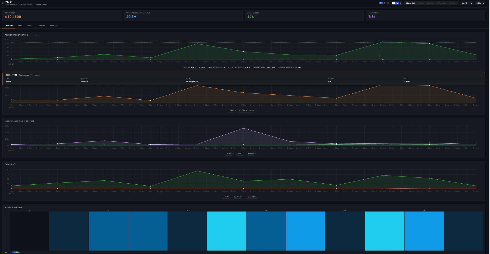

# TMA1

<!-- include_prereleases is required: every TMA1 release so far is a
     pre-release, and without it the badge renders "no releases found".
     Leave sort at the default (date) — semver sort compares the
     pre-release identifier lexically, which orders alpha9 above alpha14. -->
[](https://github.com/tma1-ai/tma1/releases)
[](https://github.com/tma1-ai/tma1/actions/workflows/ci.yml)
[](LICENSE)


> A monolith for your agent's loop. Silent until it talks back.

TMA1 is local-first observability for LLM agents, powered by GreptimeDB.
It records every LLM call on your machine, then routes what it sees back
into the agent's next turn through hooks and MCP tools.

One binary. No Docker. No Grafana. No cloud account.



The name comes from TMA-1 (Tycho Magnetic Anomaly-1) in *2001: A Space
Odyssey*: the monolith buried on the moon, silently recording everything
until you dig it out.

## Quickstart

```bash
curl -fsSL https://tma1.ai/install.sh | TMA1_ADAPTER=claude-code bash
```

The installer registers TMA1 as a background service and starts it. The
dashboard is at <http://localhost:14318>.

`TMA1_ADAPTER` accepts `claude-code`, `codex`, or `all`. See
[Install](#install) for Windows and for installing without an adapter.

## What it does

TMA1 does two things.

It feeds context to the agent. Before each turn the agent receives a
`<tma1-context>` block: what it has done this session, which files changed
under it, whether the build is broken, and any anomaly worth acting on.
The `Stop` hook blocks turn completion while a HIGH-severity issue is
unresolved. Ten MCP tools answer further queries on demand, including
keyword search across every session recorded on the machine.

It reports to you. The dashboard covers token usage, cost, latency,
tool activity, conversation replay, anomaly history, prompt evaluation,
and SQL over the raw tables.

## Supported sources

| Source | How TMA1 reads it | What you get |
|--------|-------------------|--------------|
| Claude Code | OTel metrics/logs/traces, hooks, JSONL transcripts | Cost, tools, traces, sessions, anomalies, injected context |
| Codex | OTel logs/metrics, hooks, JSONL sessions | Cost, tools, sessions, anomalies, injected context |
| Copilot CLI | JSONL sessions from `~/.copilot/session-state/` | Sessions, tools, cost where available |
| OpenClaw | OTel traces/metrics, JSONL sessions | Traces, cost, sessions, security signals |
| Any GenAI app | OTel traces using GenAI semantic conventions | Traces, latency, cost aggregation |

All data is stored locally under `~/.tma1/`.

## How it fits together

```text
Agent -- OTLP/HTTP --+
       -- /api/hooks +--> tma1-server (port 14318)
       -- MCP stdio --+        |
                              v
                        GreptimeDB (port 14000)
                              |
                              v
                        Embedded dashboard
```

TMA1 reverse-proxies OTLP to GreptimeDB, ingests hook events and JSONL
transcripts, runs the perception layer, stores everything in GreptimeDB, and
serves the dashboard.

Traces, metrics, and logs are kept as queryable data. Session data and
anomaly emits live in `tma1_*` tables.

Four query surfaces: the TMA1 dashboard, the `exec_query` MCP tool,
MySQL protocol on port `14002`, and GreptimeDB's own dashboard
(SQL/PromQL editor, table browser) at
<http://localhost:14000/dashboard/#/dashboard/query>.

## Closing the agent loop

TMA1 pushes and pulls context.

Hooks push context into the next agent turn. The installer registers all
27 Claude Code hook events for telemetry, but only five of them inject
anything back: `SessionStart`, `UserPromptSubmit`, `PostToolUse`, `Stop`,
and `PreCompact`. Codex registers five and injects on four; it has no
`PreCompact`, and it ignores `additionalContext` from `PreToolUse`, so
that one is telemetry only.

The hook script POSTs to `http://127.0.0.1:14318/api/hooks`; the response
body becomes agent context. When TMA1 is unreachable or slow the hook
returns empty stdout and the agent continues without it.

MCP serves the pull direction, from the same binary:

```bash
tma1-server mcp-serve
```

It exposes:

| Tool | Purpose |
|------|---------|
| `get_context_bundle` | One compact view of session state, anomalies, build status, external changes, and project structure |
| `get_session_state` | Tool history, token totals, current focus, recent files |
| `get_anomalies` | Active anomalies for the session |
| `get_build_status` | Last captured build/dev output |
| `get_external_changes` | Files changed outside the agent loop |
| `get_project_state` | Cached project language, build system, key files, top-level dirs |
| `get_peer_sessions` | Recent sessions on this project by agent — peers, or your own with `agent_source: "self"` |
| `search_sessions` | Find past sessions by what was said in them |
| `get_session_transcript` | Read one session's conversation, by id or id prefix |
| `exec_query` | One read-only `SELECT` against the local database |

`/tma1-peer codex` wraps `get_peer_sessions`: Claude Code reads Codex's
work on the same project verbatim. The Codex-side skill does the reverse.

Session history is queryable by the agent itself:

```
/tma1-search retry backoff        # which past sessions discussed this?
/tma1-search --session 3d8f1d0a   # read that session's conversation
/tma1-peer self --limit 3         # what did I do here earlier today?
```

`search_sessions` returns snippets and a `session_id`.
`get_session_transcript` accepts that id, or the 8-character abbreviation
from the `<tma1-context>` block, and pages through the conversation.

## Install

`TMA1_ADAPTER` wires a coding agent's hooks, MCP entry, and skills.
Claude Code and Codex require it for context injection and the `/tma1-*`
commands. It is optional otherwise: OTLP traffic to port 14318 is
recorded without it, and Copilot CLI sessions are discovered from disk.

```bash
# macOS / Linux
curl -fsSL https://tma1.ai/install.sh | TMA1_ADAPTER=claude-code bash
curl -fsSL https://tma1.ai/install.sh | TMA1_ADAPTER=codex bash
curl -fsSL https://tma1.ai/install.sh | TMA1_ADAPTER=all bash

# no adapter — server only, wire an agent later
curl -fsSL https://tma1.ai/install.sh | bash
```

Windows PowerShell, with the adapter as an environment variable:

```powershell
$env:TMA1_ADAPTER = 'claude-code'; irm https://tma1.ai/install.ps1 | iex
```

The installer registers a background service (launchd agent on macOS,
systemd user unit on Linux, scheduled task on Windows) and starts it. The
dashboard is available at <http://localhost:14318> when the script exits.
Start `tma1-server` manually only when building from source, or when
service registration was skipped.

On first start TMA1 writes a GreptimeDB config into `~/.tma1/config/`,
downloads the GreptimeDB binary if needed, starts it as a child process,
and serves the dashboard from the same `tma1-server` process.

## Wire an agent

To have the agent install TMA1 itself:

```text
Read https://tma1.ai/SKILL.md and follow the instructions to install or upgrade TMA1 for your AI agent
```

The curl installer writes global files only: hook scripts, MCP config,
and the TMA1 skills. Project-local `AGENTS.md` and `CLAUDE.md` are left
untouched.

Skill and command files are written by `install`, not refreshed by the
binary at startup. Re-run `install --adapter` after upgrading;
`tma1-server` logs a warning at startup when the installed files no
longer match the binary.

For project-local instructions, run from the project root:

```bash
tma1-server install --adapter claude-code --project .
tma1-server install --adapter codex --project .
```

Uninstall adapter wiring:

```bash
tma1-server uninstall --adapter claude-code --project .
tma1-server uninstall --adapter codex --project .
```

## Build sensor

The build wrapper captures dev and test output and feeds failures back to
the agent. Two modes:

```bash
# One-shot — wrapper exits with the wrapped command's exit code:
tma1 build --tag test -- make test
tma1 build --filter-regex '^error|FAIL' -- pytest -v

# Persistent (dev servers, watchers) — use --watch for time-debounced flush
# and Ctrl-C signal forwarding:
tma1 build --watch --tag dev -- npm run dev
tma1 build --watch --tag watch -- cargo watch -x test
```

The build sensor writes to `tma1_build_events`. Anomaly rules
(`repeated_failed_build`, `build_broken_after_my_edit`) read this table
to tell the agent to stop retrying the same failing command and fix the
current error first.

Supported flags:

| Flag | Purpose |
|------|---------|
| `--watch` | Long-running mode: flush on a debounce interval instead of by line count, and forward SIGINT/SIGTERM to the wrapped process. Required for persistent processes like `npm run dev`. |
| `--debounce DUR` | Flush interval for `--watch` (default `2s`) |
| `--tag NAME` | Tag this build run so the dashboard can group it (e.g. `npm`, `pytest`) |
| `--filter-regex PAT` | Only capture lines matching the pattern |
| `--filter-invert` | Invert the filter — capture lines NOT matching the pattern |
| `--no-color` | Strip ANSI color codes from captured output |
| `--project DIR` | Override the project directory used for scoping (default: cwd) |

## OTLP endpoints

Use the wildcard endpoint when the agent or SDK supports it:

```text
http://localhost:14318/v1/otlp
```

Direct signal endpoints are also accepted:

```text
http://localhost:14318/v1/traces
http://localhost:14318/v1/metrics
http://localhost:14318/v1/logs
```

Codex commonly uses separate per-signal endpoints; most OTel SDKs can use
the single `/v1/otlp` base.

## Configuration

| Variable | Default | Description |
|----------|---------|-------------|
| `TMA1_HOST` | `127.0.0.1` | Address `tma1-server` binds to |
| `TMA1_PORT` | `14318` | HTTP port for `tma1-server` |
| `TMA1_DATA_DIR` | `~/.tma1` | Data, config, and binary directory |
| `TMA1_GREPTIMEDB_VERSION` | `v1.2.0-beta.2` | GreptimeDB version to install. Pinned to an exact tag; set to `latest` to track stable releases instead |
| `TMA1_GREPTIMEDB_HTTP_PORT` | `14000` | GreptimeDB HTTP and OTLP port |
| `TMA1_GREPTIMEDB_GRPC_PORT` | `14001` | GreptimeDB gRPC port |
| `TMA1_GREPTIMEDB_MYSQL_PORT` | `14002` | GreptimeDB MySQL protocol port |
| `TMA1_LOG_LEVEL` | `info` | `debug`, `info`, `warn`, or `error` |
| `TMA1_DATA_TTL` | `60d` | Default TTL for auto-created tables |
| `TMA1_LLM_API_KEY` | empty | API key for optional prompt evaluation |
| `TMA1_LLM_PROVIDER` | `anthropic` | `anthropic` or `openai` |
| `TMA1_LLM_MODEL` | auto | Model override for prompt evaluation |
| `TMA1_QUERY_CONCURRENCY` | `4` | Max concurrent SQL queries from the dashboard |
| `TMA1_ADAPTER` | empty | Install-time adapter list: `claude-code`, `codex`, comma-separated, or `all` |
| `TMA1_MCP_CALLER` | empty | Set by adapter installers. Identifies the calling agent, so `get_peer_sessions` can exclude it from the default fan-out and resolve `agent_source: "self"` |
| `TMA1_DISABLE_INJECTION` | unset | Set to `1` to record hooks but return no injected context |
| `TMA1_ENABLE_FILE_CALLBACK` | unset | Set to `1` to write `.tma1-context.md` for non-MCP agents |
| `TMA1_CONTEXT_PRESSURE_THRESHOLD` | `700000` | Input-token threshold for context-pressure anomalies (~70% of a 1M window). Lower it if your model has a smaller context |
| `OPENCLAW_STATE_DIR` | `~/.openclaw` | Override the OpenClaw session directory |

Settings changed in the dashboard are saved to `~/.tma1/settings.json`.
Environment variables take priority.

## CLI

The installer symlinks `tma1-server` as `tma1`.

| Command | Purpose |
|---------|---------|
| `tma1 install --adapter <name>` | Wire a coding agent into TMA1 (`claude-code`, `codex`) |
| `tma1 uninstall --adapter <name>` | Reverse install for one adapter |
| `tma1 build [--watch] -- <cmd>` | Wrap a build/test command and ship its output into `tma1_build_events` |
| `tma1 mcp-serve` | JSON-RPC MCP stdio server; spawned by agents, not invoked directly |
| `tma1 help [SUB]` | Print top-level usage, or details for a specific subcommand |
| `tma1 version` | Print the tma1-server version |

Every subcommand accepts `-h` / `--help`. Run `tma1 help build` or
`tma1 build --help` for the full flag list and examples.

## Development

```bash
make build           # Build server/bin/tma1-server
make run             # Build and run locally
make dev             # Auto-rebuild and restart on server file changes (requires fswatch)
make install         # Install dev build to ~/.tma1/bin
make sync-plugin     # Mirror plugin skills/commands into embedded server files
make vet             # go vet ./cmd/... ./internal/... ./web
make lint            # golangci-lint v2
make lint-js         # ESLint for dashboard JS
make test            # go test -race -count=1
make check           # vet + lint + test + lint-js
make build-linux     # Cross-compile Linux amd64
make build-windows   # Cross-compile Windows amd64
```

Build from source:

```bash
git clone https://github.com/tma1-ai/tma1.git
cd tma1
make build
./server/bin/tma1-server
```

CI also runs ShellCheck for `site/public/install.sh` and PSScriptAnalyzer
for `site/public/install.ps1`.

## Docs

- [Architecture](docs/architecture.md): module layout, data flow, tables,
  env vars, file index
- [Hooks](docs/hooks.md): hook protocol, adapter registration, uninstall
- [MCP tools](docs/mcp-tools.md): tool schemas and behavior
- [Anomalies](docs/anomalies.md): rules, channels, suppression, validation

Troubleshooting, including the case where no data appears, is covered in
the setup skill: <https://tma1.ai/SKILL.md>

## Explicitly absent

- No cloud service
- No OTel Collector requirement
- No Grafana dependency
- No memory or RAG system
- No multi-tenant mode
- No authentication; TMA1 is a local-only tool

## License

Apache-2.0
